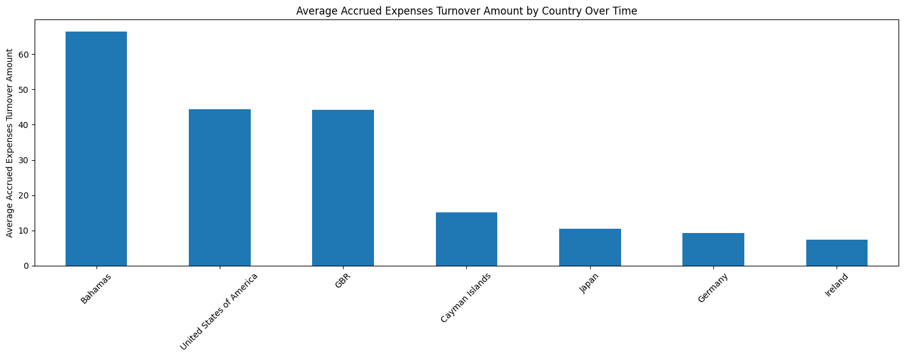
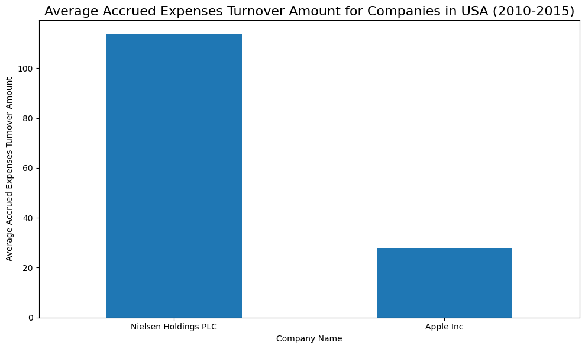
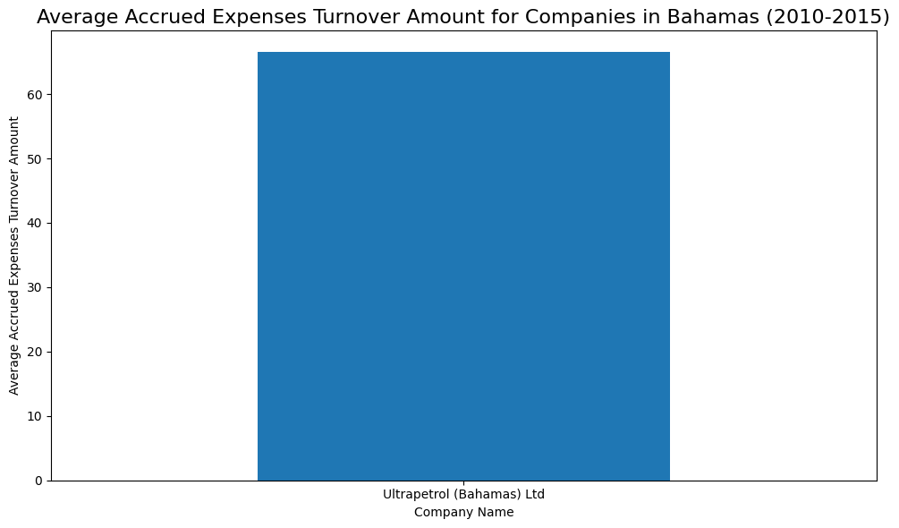

# 📈 Financial Analysis with Nasdaq Data Link API

# 📌 Project Overview
This project explores financial analysis by integrating with the **Nasdaq Data Link API**. The primary focus is to extract and analyze data from the `MER/F1` data table, which contains detailed metrics including balance sheets, cash flow statements, and income statements.

The core objective is to calculate and compare the **Accrued Expenses Turnover** across a specific set of companies and regions to understand their financial performance and operational efficiency over time.

# 🎯 Key Objectives
* **API Integration:** Automate the retrieval of financial data using Python and the Nasdaq API.
* **Data Cleaning:** Process raw JSON/CSV data into structured Pandas DataFrames.
* **Financial Metric Analysis:** Calculate the "Accrued Expenses Turnover" ratio.
* **Comparative Analysis:** Explore how this efficiency ratio differs among various companies.

# 🧠 Key Concept: Accrued Expenses Turnover
This project focuses heavily on the **Accrued Expenses Turnover** ratio, a key indicator of financial efficiency.

> **Formula:** *Cost of Goods Sold (or Operating Expenses) / Average Accrued Expenses*

We use this metric to evaluate:
1.  **Cash Flow Management:** Indicates how well a company manages cash flow relative to short-term obligations.
2.  **Operational Efficiency:** Reflects how promptly a company settles short-term debts.
3.  **Financial Health:** A strong indicator of creditworthiness and stability.

# 🛠️ Technologies & Tools
* **Python 3.x**
* **Pandas:** For data manipulation and aggregation.
* **Requests:** For handling API calls to Nasdaq Data Link.
* **Matplotlib / Seaborn:** For visualizing trends and comparisons.
* **Nasdaq Data Link API:** Source of the `MER/F1` financial dataset.

# 2) 🚀 Getting Started
In order to access Nasdaq API, it is necesary to create an API Key associated with an account.
These are the steps to generate an API Key:

1) Create an Account [here](https://data.nasdaq.com/sign-up)
2) Fill in your details, including your first name, last name, and email address.

3) Once you have the account ready, you should be able to find the API key in your Account Settings under your profile.

4) To keep your API key secure, especially when sharing your Jupyter Notebooks, store it in a separate Python file ( e.g., `config.py`) and import this file into your notebook.

``` Python
import config
api_key = config.API_KEY
```

With your API key in hand, the next task is determining the appropriate API endpoint and the parameters needed to query the financial data. For guidance on constructing your query, refer to the [Nasdaq Data Link API documentation](https://docs.data.nasdaq.com/docs/in-depth-usage-1).

## 2.1 📂 Data Source: Mergent Global Fundamentals (MER/F1)

**Overview**
The analysis relies on the **Mergent Global Fundamentals (MF1)** data feed. It provides fundamental indicators on publicly traded companies covered by the Russell Global Index.
* **Coverage:** 15,000+ companies across 67 countries.
* **History:** Financial statements dating back to 2005.
* **Update Frequency:** Data is updated daily at 02:30 AM UTC.
* **Focus:** Primary focus on U.S. traded companies filing with the SEC, with a reporting lag varying from 5 to 75 days depending on the filing method.

You can download the full list of covered companies [here](https://static.quandl.com/mergent/mergent-companies.csv).

### 📖 Data Dictionary
Below is the detailed schema of the dataset used in this project.

<details>
<summary><strong>Click to expand the full Column Definitions Table</strong></summary>

| **Column Name** | **Description** | **Type** |
|:---|:---|:---|
| **compnumber** | Internal company identifier; permanent and unique per company. | `integer` |
| **reportid** | Unique report period identifier per company/mapcode/date. | `integer` |
| **mapcode** | Identifier of a financial account. Used to map indicators. | `integer` |
| **amount** | The actual indicator value associated with the mapcode. | `decimal` |
| **reportdate** | Date of the financial report period. | `date` |
| **reporttype** | Type of report (e.g., Annual, Quarterly). | `string` |
| **auditorstatus**| Code indicating the audit status of the report. | `string` |
| **currency** | ISO currency code of the report. | `string` |
| **consolidated** | Indicates whether the report is consolidated ('TRUE'/'FALSE'). | `string` |
| **longname** | Official company name. | `string` |
| **shortname** | Common or abbreviated company name. | `string` |
| **status** | Company operating status (Active/Inactive). | `string` |
| **countrycode** | ISO country code of incorporation. | `string` |
| **cik** | SEC Central Index Key (Permanent numeric identifier). | `integer` |
| **mic** | Mergent industry classification code. | `string` |
| **ticker** | Stock ticker for the primary listing. | `string` |
| **exchange**

</details>

## 2.2📡 Methodology: API Interaction

To ensure precise data extraction, this project interacts with the `MER/F1` endpoint using specific filter parameters.

### Query Structure
The data was retrieved using the standard Nasdaq Data Link API structure:
`https://data.nasdaq.com/api/v3/datatables/MER/F1.json`

Key parameters used to filter the huge dataset included:

| Parameter | Value (Example) | Purpose |
| :--- | :--- | :--- |
| **mapcode** | `-5370` | Selects specific financial metrics (e.g., Accrued Expenses). |
| **compnumber** | `39102` | Filters for specific companies (e.g., Nokia). |
| **reporttype** | `A` | Restricts results to **Annual** reports. |
| **qopts.columns**| `reportdate,amount` | Optimizes the payload by requesting only necessary columns. |

### ⚡ Performance & Rate Limits
To ensure the stability of the extraction process, the script adheres to Nasdaq's API rate limits for authenticated users.

## 💻 Implementation Details

### 1. Data Extraction Pipeline
The project utilizes the `requests` library to fetch data from the Nasdaq API. The raw response is processed in JSON format to allow for granular inspection before conversion to a DataFrame.

### 2. JSON Structure Analysis
Understanding the raw data structure was critical for correct parsing. The Nasdaq API response returns a nested dictionary with two primary keys:

1.  **`meta`**: Contains pagination information (e.g., `next_cursor_id`), essential for iterating through large datasets.
2.  **`datatable`**: Contains the actual financial data, split into two lists:
    * **`columns`**: Defines the schema (name and data type of each column).
    * **`data`**: A list of lists containing the actual values.

**Sample JSON Structure:**
To map the data correctly, we identified that the `data` list corresponds positionally to the `columns` list:

```json
{
    "datatable": {
        "data": [
            [2438, 1868192544, -1802, 10.48, "2011-06-30", "Q2", ...]
        ],
        "columns": [
            {"name": "compnumber", "type": "Integer"},
            {"name": "reportid", "type": "Integer"},
            {"name": "mapcode", "type": "Integer"},
            {"name": "amount", "type": "BigDecimal(36,14)"},
            {"name": "reportdate", "type": "Date"}
        ]
    },
    "meta": {
        "next_cursor_id": "mzS2..."
    }
}

```

## 🐼 Data Processing & Feature Selection

### 1. Conversion to DataFrame
Once the JSON data is retrieved, the project converts the nested dictionary structure into a flat Pandas DataFrame for analysis.

* **Scalability:** The API request parameters were adjusted (`qopts.per_page: 10000`) to maximize data retrieval per call.
* **Parsing:** List comprehension was used to extract column names dynamically from the `datatable` > `columns` key, ensuring the DataFrame schema matches the API output perfectly.

```python
# Code Snippet: JSON to DataFrame
data = json_data['datatable']['data']
column_names = [col['name'] for col in json_data['datatable']['columns']]
df_metric = pd.DataFrame(data, columns=column_names)
```

### 2. Feature Selection
The raw dataset contains numerous columns. Based on the project goal—analyzing **Accrued Expenses Turnover** specifically for **Banks** across different **Regions**—the following key features were selected for the final dataset:

| Feature | Relevance to Analysis |
| :--- | :--- |
| **`indicator`** | Identifies the specific financial metric. |
| **`mapcode`** | Used for precise filtering of the "Accrued Expenses" account. |
| **`amount`** | The numerical value used to calculate the turnover ratio. |
| **`reportdate`** | Essential for time-series analysis (Trend over time). |
| **`country`** | Enables the comparative analysis between regions. |
| **`longname`** | Identifies the specific banking institutions. |
| **`reporttype`** | Ensures we are comparing consistent timeframes (e.g., Annual vs Quarterly). |

### 3. Data Transformation & Statistical Snapshot

To isolate the relevant financial signal, the dataset was filtered to retain only the records where the indicator is **'Accrued Expenses Turnover'**.

> **Code Filter Applied:**
> `filtered_df = df_metric[necessary_columns][df_metric['indicator']=='Accrued Expenses Turnover']`

#### 📊 Preliminary Statistical Analysis
Before visualization, a descriptive statistical analysis (`df.describe()`) was performed to understand the distribution of the Turnover Ratio.

**Key Observations:**
* **Sample Size:** 139 data points analyzed.
* **High Variability:** The **Standard Deviation (33.1)** is higher than the **Mean (26.9)**, indicating a massive disparity in operational efficiency between the analyzed companies.
* **Range:** The values range significantly from a minimum of **4.69** to a maximum of **229.8**, suggesting the presence of high-performing outliers.

| Statistic | Value | Interpretation |
| :--- | :--- | :--- |
| **Mean** | 26.91 | Average turnover ratio across the sample. |
| **Std Dev** | 33.10 | Indicates high volatility in the data. |
| **Min** | 4.69 | Lower bound of efficiency. |
| **Max** | 229.81 | Upper bound (potential industry leaders). |

## 📉 Temporal Trend Analysis (2010-2015)

To understand the evolution of financial efficiency, the analysis focused on a specific 5-year window: **2010 to 2015**. This period allows us to observe trends in the banking sector with greater precision.

### 1. Data Preparation
Before visualization, specific data engineering steps were performed:
* **Type Conversion:** The `report_date` column was converted to datetime objects to allow for chronological sorting and filtering.
* **Time Filtering:** A mask was applied to isolate records between 2010 and 2015.

```python
# Code Snippet: Time Series Filtering
updated_df['report_date'] = pd.to_datetime(updated_df['report_date'])
updated_df = updated_df[(updated_df['report_date'].dt.year >= 2010) & 
                        (updated_df['report_date'].dt.year <= 2015)]
```

## 2. 📊 Comparative Analysis: Cross-Company Performance

Beyond individual trends, a comparative analysis was performed to benchmark companies against each other. This visualization highlights the disparity in **Accrued Expenses Turnover** across different sectors.

### Visualization Logic
* **Multi-Line Plot:** All selected companies were plotted on a shared timeline (2011-2016) to allow for direct scale comparison.
* **Metric:** The Y-axis represents the raw turnover amount, highlighting outliers.

### 🔍 Key Insights from the Data
The comparative chart reveals significant differences in financial behavior:


1.  **High Volatility Outliers:**
    * **Ultrapetrol (Bahamas) Ltd** (Red Line) exhibits extreme volatility, with a massive spike reaching >220 in 2015. This suggests aggressive short-term debt settlement or specific operational events during that year.
    * **Capri Holdings** also shows a significant deviation from the baseline in 2014.

2.  **Stability in Major Players:**
    * In contrast, large-cap companies like **Apple Inc**, **Deutsche Bank**, and **Canon Inc** display much lower and flatter turnover ratios (clustered at the bottom).
    * This indicates a more consistent, perhaps more conservative, approach to managing accrued expenses compared to the more volatile entities.

### 🌍 Regional Case Study: The Bahamas Anomaly

A deeper dive into the geographical data revealed a surprising insight: The **Bahamas** region outperformed major economic hubs like the USA and Germany in terms of average Accrued Expenses Turnover.

### 1. The Observation
When aggregating data by country, Bahamas emerged as the leader with an average turnover > 65, significantly higher than the USA (~45).



### 2. Drill-Down: What is driving the Bahamas' numbers?
To understand this disparity, we isolated the companies within these regions to compare the specific entities driving these averages.

* **USA Analysis:** The region is dominated by giants like **Apple Inc**, which holds a turnover ratio of ~28.
* **Bahamas Analysis:** The region's average is heavily skewed by **Ultrapetrol (Bahamas) Ltd**, which maintains a ratio significantly higher than 60.

| Region | Key Company | Approx. Ratio | Interpretation |
| :--- | :--- | :--- | :--- |
| **USA** 🇺🇸 | Apple Inc | ~28 | Lower turnover suggests massive accrued expenses retained on books, typical of large-cap tech operations with complex supply chains. |
| **Bahamas** 🇧🇸 | Ultrapetrol | ~66 | Extremely high turnover indicates rapid settlement of short-term liabilities, or a business model (likely Maritime/Transport) with different working capital requirements. |

### 3. Visual Comparison
The contrast is evident when comparing the specific company distributions:

<div style="display: flex; justify-content: space-between;">
  
  
</div>

> **Conclusion:** The high regional average for the Bahamas is not necessarily a sign of broader regional economic superiority, but rather a reflection of specific operational efficiencies within *Ultrapetrol*, acting as a positive outlier against the broader market standard set by companies like Apple.

